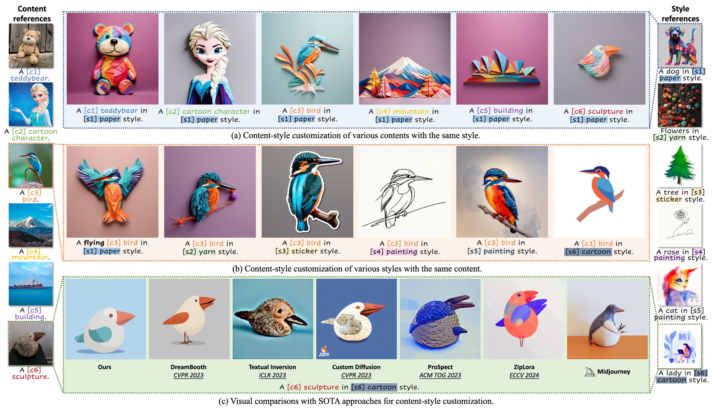
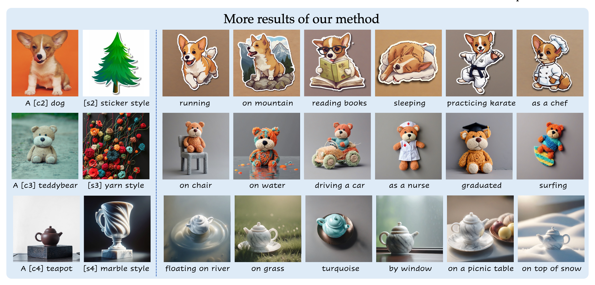

# B4M: Breaking Low-Rank Adapter for Making Content-Style Customization [ACM TOG 2025]

> **B4M: Breaking Low-Rank Adapter for Making Content-Style Customization**<br>
> Yu Xu<sup>1,2</sup>, Fan Tang<sup>1</sup>, Juan Cao<sup>1</sup>, Yuxin Zhang<sup>3</sup>, Oliver Deussen<sup>4</sup>, Weiming Dong<sup>3</sup>, Jintao Li<sup>1</sup>, Tong-Yee Lee<sup>5</sup> <br>
> <sup>1</sup>Institute of Computing Technology, Chinese Academy of Sciences, <sup>2</sup>University of Chinese Academy of Sciences, <sup>3</sup> Institute of Automation, Chinese Academy of Sciences, <sup>4</sup>University of Konstanz, <sup>5</sup>National Cheng Kung University




<a href='https://arxiv.org/abs/2403.19456'></a> 


>**Abstract**: <br>
>Personalized generation paradigms empower designers to customize visual intellectual properties with the help of textual descriptions by adapting pre-trained text-to-image models on a few images. Recent studies focus on simultaneously customizing content and detailed visual style in images but often struggle with entangling the two. In this study, we reconsider the customization of content and style concepts from the perspective of parameter space construction. Unlike existing methods that utilize a shared parameter space for content and style learning, we propose a novel framework that separates the parameter space to facilitate individual learning of content and style by introducing "partly learnable projection" (PLP) matrices to separate the original adapters into divided sub-parameter spaces. A "break-for-make" customization learning pipeline based on PLP is proposed: we first "break" the original adapters into "up projection" and "down projection" for content and style concept under orthogonal prior and then "make" the entity parameter space by reconstructing the content and style PLPs matrices by using Riemannian precondition to adaptively balance content and style learning. Experiments on various styles, including textures, materials, and artistic style, show that our method outperforms state-of-the-art single/multiple concept learning pipelines regarding content-style-prompt alignment.


## More of our results



## Environment Dependencies

Our code is built on Huggingface Diffusers (0.22.0), please follow [sdxl](https://github.com/huggingface/diffusers/blob/v0.22.0-release/examples/dreambooth/README_sdxl.md) for environment setup.


### Install B4M
First clone this repo, and then
```bash
cd B4M
pip install -e .
```


## Training Instructions

The training process include two stages.

### Stage One: Train Content and Style Separately

- **Train the content model**  
  Run the following script:

  ```bash

  bash code/train_content.sh
  ```

- **Train the style model**  
  Run the following script:

  ```bash
  bash code/train_style.sh
  ```

> Note: In both scripts, please replace any dataset paths, output directories, and other file paths with your own.

### Stage Two: Joint Training with Riemannian Precondition

After completing the first stage, run the following script to start the second-stage training:

```bash
bash code/train_second_stage.sh
```

> As before, make sure to update the paths in the script to fit your environment.

## Inference

After training is complete, you can run inference using:

```bash
python infer.py
```

Make sure to configure the model path and input settings inside the script as needed.


## TODO List

- [x] Open source the code  
- [ ] Upload the checkpoints used in the paper examples  


Check out the [Quickstart](https://huggingface.co/docs/diffusers/quicktour) to launch your diffusion journey today!

## How to navigate the documentation


</table>

## Popular libraries using 🧨 Diffusers

- https://github.com/microsoft/TaskMatrix
- https://github.com/invoke-ai/InvokeAI
- https://github.com/apple/ml-stable-diffusion
- https://github.com/Sanster/lama-cleaner
- https://github.com/IDEA-Research/Grounded-Segment-Anything
- https://github.com/ashawkey/stable-dreamfusion
- https://github.com/deep-floyd/IF
- https://github.com/bentoml/BentoML
- https://github.com/bmaltais/kohya_ss
- +3000 other amazing GitHub repositories 💪

Thank you for using us ❤️

## Credits

This library concretizes previous work by many different authors and would not have been possible without their great research and implementations. We'd like to thank, in particular, the following implementations which have helped us in our development and without which the API could not have been as polished today:

- @CompVis' latent diffusion models library, available [here](https://github.com/CompVis/latent-diffusion)
- @hojonathanho original DDPM implementation, available [here](https://github.com/hojonathanho/diffusion) as well as the extremely useful translation into PyTorch by @pesser, available [here](https://github.com/pesser/pytorch_diffusion)
- @ermongroup's DDIM implementation, available [here](https://github.com/ermongroup/ddim)
- @yang-song's Score-VE and Score-VP implementations, available [here](https://github.com/yang-song/score_sde_pytorch)

We also want to thank @heejkoo for the very helpful overview of papers, code and resources on diffusion models, available [here](https://github.com/heejkoo/Awesome-Diffusion-Models) as well as @crowsonkb and @rromb for useful discussions and insights.

## Citation

```bibtex
@misc{von-platen-etal-2022-diffusers,
  author = {Patrick von Platen and Suraj Patil and Anton Lozhkov and Pedro Cuenca and Nathan Lambert and Kashif Rasul and Mishig Davaadorj and Thomas Wolf},
  title = {Diffusers: State-of-the-art diffusion models},
  year = {2022},
  publisher = {GitHub},
  journal = {GitHub repository},
  howpublished = {\url{https://github.com/huggingface/diffusers}}
}
```


## Citation
If you make use of our work, please cite our paper:

```
@article{xu2025b4m,
  title={B4M: Breaking Low-Rank Adapter for Making Content-Style Customization},
  author={Xu, Yu and Tang, Fan and Cao, Juan and Zhang, Yuxin and Deussen, Oliver and Dong, Weiming and Li, Jintao and Lee, Tong-Yee},
  journal={ACM Transactions on Graphics},
  volume={44},
  number={2},
  pages={1--17},
  year={2025},
  publisher={ACM New York, NY}
}
```
