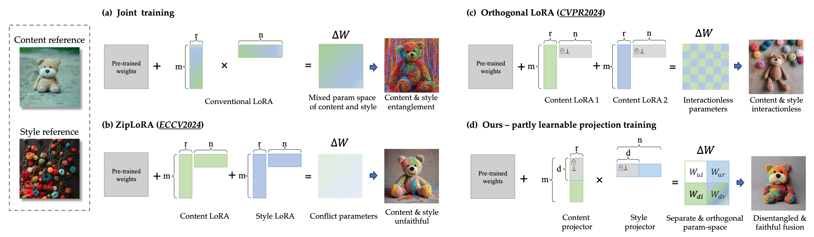
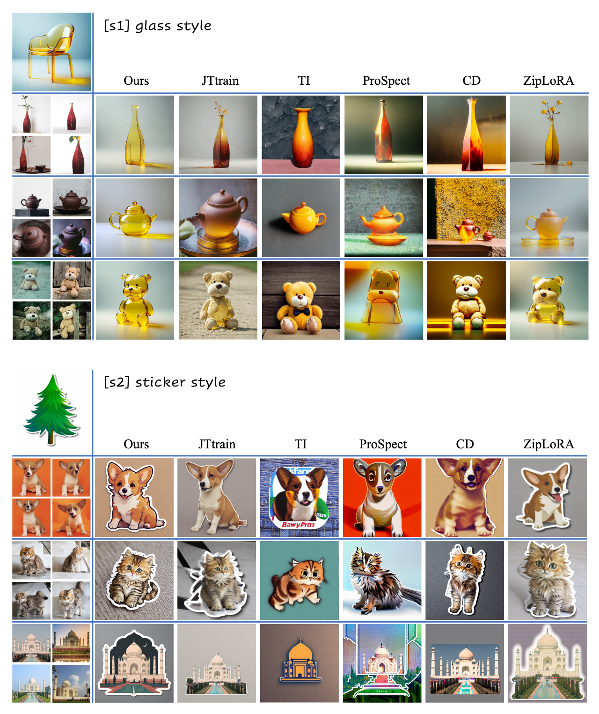

# B4M: Breaking Low-Rank Adapter for Making Content-Style Customization [ACM TOG 2025]

> **B4M: Breaking Low-Rank Adapter for Making Content-Style Customization** 
> Yu Xu1,2, Fan Tang1, Juan Cao1, Yuxin Zhang3, Oliver Deussen4, Weiming Dong3, Jintao Li1, Tong-Yee Lee5  
> 1Institute of Computing Technology, Chinese Academy of Sciences, 2University of Chinese Academy of Sciences, 3 Institute of Automation, Chinese Academy of Sciences, 4University of Konstanz, 5National Cheng Kung University

 

## Abstract
Personalized generation paradigms empower designers to customize visual intellectual properties with the help of textual descriptions by adapting pre-trained text-to-image models on a few images. Recent studies focus on simultaneously customizing content and detailed visual style in images but often struggle with entangling the two. In this study, we reconsider the customization of content and style concepts from the perspective of parameter space construction. Unlike existing methods that utilize a shared parameter space for content and style learning, we propose a novel framework that separates the parameter space to facilitate individual learning of content and style by introducing "partly learnable projection" (PLP) matrices to separate the original adapters into divided sub-parameter spaces. A "break-for-make" customization learning pipeline based on PLP is proposed: we first "break" the original adapters into "up projection" and "down projection" for content and style concept under orthogonal prior and then "make" the entity parameter space by reconstructing the content and style PLPs matrices by using Riemannian precondition to adaptively balance content and style learning. Experiments on various styles, including textures, materials, and artistic style, show that our method outperforms state-of-the-art single/multiple concept learning pipelines regarding content-style-prompt alignment.

## Pipeline

## Comparison with baselines

## More of our results

